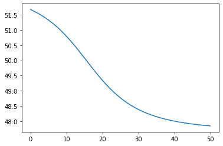
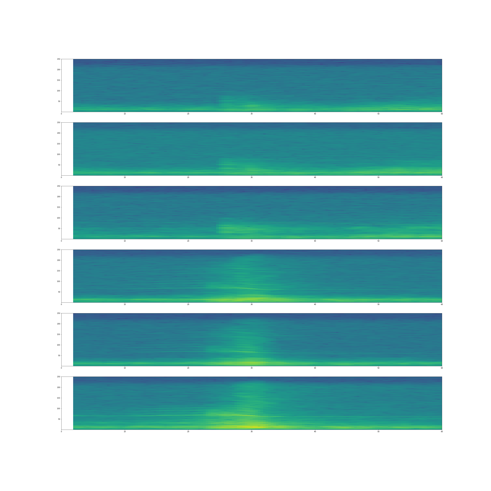

# Denali Nodal Seismic Data
## Nicholas Alexeev

## University of Alaska Fairbanks

Summarry of research undertaken between May 2022 and June 2022.
## Introduction

Between 2019-02-11 and 2019-03-26 a set of about 400 Fairfield Nodal 3C 5Hz sensors were deployed along the Parks Highway in south-central Alaska between the towns of Nenana (north) and Trapper Creek (south). A map of these can be found from the [FDSN network page](http://ds.iris.edu/gmap/#network=ZE&maxlat=64.8752&maxlon=-147.5002&minlat=62.227&minlon=-151.5871&drawingmode=box&planet=earth). We refer to the deployment as "Denali Nodal" because the stations span the east-west trending Denali fault and because the sensors are made by Nodal.

The goal of this project was to download and analyze the Denali Nodal waveforms, with the long-term objective of characterizing the wide range of recorded signals, including from earthquakes, planes, trains, and automobiles. Of particular interest are signals from planes, which have been shown to generate signals on the same type of ground-installed seismometers (Meng and Ben-Zion, 2018). The basic idea is that as a plane flies overhead, the recorded signal on the ground will exhibit a Doppler shift in the frequency-time space, with (apparent) higher frequencies occurring as the plane approaches the seismometer and (apparent) lower frequencies as the plane flies away from the seismometer. A theoretical example Doppler shift is shown below:



The preliminary work on this project was conducted on the LuNGS computer network of the Geophysical Institute at UAF. This repository contains a record of the work performed, and it should enable a future expanded effort to characterize the signals recorded by the Denali Nodal deployment.


The project is far from being completed however there has been some usefull work done. The Denali Nodal Set has been downloaded to the GI's Lungs computers and tools for viewing and analyzing the dataset have been developed.

## Downloading the Denali Nodal Set Data

The Denali Nodal set was downloaded from IRIS's PH5 archive using obspy. There was a bug in either obspy or in IRIS so the fast mass downloader could not be used. I wrote a customized downloader that saves which files were downloaded and some associated metadata into a sqlite3 database. The script runs very slowly on the GI's Lungs machines likely due to a network bottleneck. The script also supports being stopped and resumed at its stopping point if needed. The total size of the download was 1.8 Tb and it took roughly two weeks to downolad the data. The download script can be found at [download_gaps.py](download_gaps.py).

## Analyzing Earthquake Data

Tools were developed inorder to effectivly analyze the Denali Nodal Set. The work heavily uses obspy for reading seismic data and performing various analysis of the data. The codes used can be found in `prelude.py`. Most of the work was developing tools inorder to stitch out the correct data from the dataset as the file sizes used were very large and it was very easy to fill up the computers ram if naive techniques were used to load data. Therefore, I developed tools that only loaded the data that was requested. Plotting tools were also developed. Most notably a tool was developed inorder to plot spectrograms from several stations at once. This tool is useful because it makes it easier to see move out in suspicious signals across several stations. An example plot is shown below.

## Planes Data

Currently, the planes data is from opensky, a volunteer run database of locations of planes based on listing to plane transponders. This data only covers a region over Anchorage. First Carl Tape applied for data access from <https://opensky-network.org/> and then the data was scraped from the provided sql database. I then wrote a parser in rust inorder to put the data into a sqllite database. The parser was written in rust because python would not be performant enough to parse the data in a timely manner. 

Another flight databse exists but it is expensive, <https://www.flightradar24.com/>. Another issue to keep in mind is that is likely that all flight databases will have significant holes as not all aircraft has transponders and I have not seen many military air craft on flightradar24, which does not appear to match what I have anacdotally seen in Alaska.


## Code Organization

Most of the code is contained inside jupyter notebooks aside from prelude.py which contains shared functions usefull for looking at the data.

## Environment
Inorder to use this project, in terminal run 

```conda env create environment.yml```

Next run 

```conda activate denalinodal```

The code uses the following packages, inorder to run the code install the latest version of each of the packages

- obspy for reading sismic data

- matplotlib for custom plotting

- numpy for manipulating arrays

- cartopy

- tqdm, used to display progress bars on long compute tasks

- scipy


## Possible Future Directions

A possible future direction may be to view the entire dataset as a series of spectrograms and cataloging all suspcious signals. It may also be usefull to buy the flight24 data as it appears to be more complete than the data from flight radar. If the project is transitioned to use realtime data from the Alaska Eartquake Center it may also be possible to collect transponder data on your own as the equipment needed is not very expensive.


