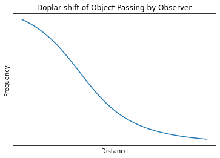

# Denali Nodal Set Data
This repository contains code used to look at the denali nodal set and attempt to find planes in the sismic signals.

## Introduction

The goal of this project was to use the Denali Nodal set inorder to find out what aircraft signals look like on seismic sensors. The Denali nodal set is a temporary array that was installed from  2019-02-11 to 2019-03-26. It was installed along the parks highway going from Nenana to Talketna. The stations were each one mile from each other. It is expected that the plane signal will contain a doplar shift as it is moving quickly past the station as shown below. 

The project is far from being completed however there has been some usefull work done. The Denali Nodal Set has been downloaded to the GI's Lungs computers and tools for viewing and analyzing the dataset have been developed.

## Downloading the Denali Nodal Set Data

The Denali Nodal set was downloaded from IRIS's PH5 archive using obspy. There was a bug in either obspy or in IRIS so the fast mass downloader could not be used. I wrote a customized downloader that saves which files were downloaded and some associated metadata into a sqlite3 database. The script runs very slowly on the GI's Lungs machines likely due to a network bottleneck. The script also supports being stopped and resumed at its stopping point if needed.

## Analyzing Earthquake Data

Tools were developed inorder to effectivly analyze the Denali Nodal Set. The work heavily uses obspy for reading seismic data and performing various analysis of the data. The codes used can be found in `prelude.py`. Most of the work was developing tools inorder to stitch out the correct data from the dataset as the file sizes used were very large and it was very easy to fill up the computers ram if naive techniques were used to load data. Therefore, I developed tools that only loaded the data that was requested. Plotting tools were also developed. Most notably a tool was developed inorder to plot spectrograms from several stations at once. This tool is useful because it makes it easier to see move out in suspicious signals across several stations. An example plot is shown below.
## Planes Data

Currently, the planes data is from opensky, a volunteer run database of locations of planes based on listing to plane transponders. This data only covers a region over Anchorage. Another flight databse exists but it is expensive, <https://www.flightradar24.com/>. Another issue to keep in mind is that is likely that all flight databases will have significant holes as not all aircraft has transponders and I have not seen many military air craft on flightradar24, which does not appear to match what I have anacdotally seen in Alaska.

## Possible Future Directions

A possible future direction may be to view the entire dataset as a series of spectrograms and cataloging all suspcious signals. It may also be usefull to buy the flight24 data as it appears to be more complete than the data from flight radar. 
## Code Organization

Most of the code is contained inside jupyter notebooks aside from prelude.py which contains shared functions usefull for looking at the data.

## Environment

The code uses the following packages, inorder to run the code install the latest version of each of the packages

- obspy for reading sismic data

- matplotlib for custom plotting

- numpy for manipulating arrays

- cartopy

- tqdm, used to display progress bars on long compute tasks

- scipy

 

### Getting data from OpenSky

First Carl Tape applied for data access from <https://opensky-network.org/> and then the data was scraped from the provided sql database. I then wrote a parser in rust inorder to put the data into a sqllite database. The parser was written in rust because python would not be performant enough to parse the data in a timely manner. 
